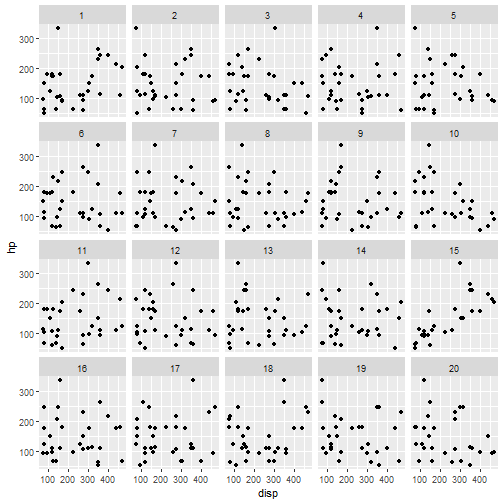

Deep Visual Inference: Teaching Computers To See Rather Than Calculate Correlation
========================================================
author: Giora Simchoni
date: July 31st, 2019
autosize: true

JSM 2019

This RPres/html is available at Github or at:
http://bit.ly/jsm2019

Who am I
========================================================

- Graduated MSc Statistics from TAU in 2010
- Data Scientist (otherwise they won't hire me) subspecies Statistician
- 888 2 years, ebay 3 years, IBM 1.5 years, vFunction 1.5 years
- Blogger: [Sex, Drugs and Data](http://giorasimchoni.com)
- R/Python enthusiast: [Github](https://github.com/gsimchoni)

bit.ly/jsm2019

Line 'Em Up!
========================================================
title: FALSE
type: black_center

# Line 'Em Up!

Does your plot contain a signal over noise?
========================================================
incremental: true

- The key to understanding Visual Inference:
- A plot is a statistic
- Permute your data a few times, gather a few plots
- Judge your plot vs. the distribution of plots
- Assumption-free, Parameter-free
- But how to present a distribution of plots?

bit.ly/jsm2019

Like so...
========================================================

### Is there a relation between a car's Displacement and its Horse Power?

bit.ly/jsm2019

And so...
========================================================

### Is there a relation between Gender and Answer?
#### (Is it rude to bring a baby on plane?)

bit.ly/jsm2019

And so...
========================================================

### Is there a relation between an actor's gender and no. of roles since his/her character ended?

bit.ly/jsm2019

But wait
========================================================
title: FALSE
type: black_center

# But wait, did you just say "judge a plot", as in "classify an image", and the year >= 2012?

Me Against My Laptop
========================================================
title: FALSE
type: black_center

# Me Against My Laptop

How many scatterplots have I looked at?
========================================================
incremental: true

- Scatterplots, Residual plots, Pairs plots
- Say 3 plots a day (as if) X 5 days a week X 52 weeks a year X 9 years since graduation = 7K
- Well, my laptop can look at 20K scatterplots in 1 minute
- Is my laptop a better Statistician than me? No.
- *Could* my laptop be a better Statistician than me?

bit.ly/jsm2019

Thank You
========================================================
title: FALSE
type: back_image

# Thank You.
