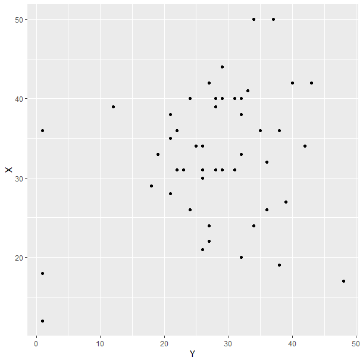

Deep Visual Inference: Teaching Computers To See Rather Than Calculate Correlation
========================================================
author: Giora Simchoni
date: July 31st, 2019
autosize: true

JSM 2019

This RPres/html is available at Github or at:
http://bit.ly/jsm2019

Who am I
========================================================

- Graduated MSc Statistics from TAU in 2010
- Data Scientist (otherwise they won't hire me) subspecies Statistician
- 888, ebay, IBM, vFunction
- Blogger: [Sex, Drugs and Data](http://giorasimchoni.com)
- R/Python enthusiast: [Github](https://github.com/gsimchoni)

bit.ly/jsm2019

Line 'Em Up!
========================================================
title: FALSE
type: black_center

# Line 'Em Up!

Does your plot contain a signal over noise?
========================================================
incremental: true

- The key to understanding Visual Inference:
- A plot is a statistic
- Permute your data a few times, gather a few plots
- Judge your plot vs. the distribution of plots or run a survey
- Assumption-free, Parameter-free
- But how to present a distribution of plots?

bit.ly/jsm2019

Like so...
========================================================

### Is there a relation between a car's Engine Displacement and its Horse Power? (n = 32)

bit.ly/jsm2019

And so...
========================================================

### Is there a relation between Gender and Answer? (n = 843)
#### Q: Is it rude to bring a baby on plane?

bit.ly/jsm2019

And so...
========================================================

### Is there a relation between an actor's gender and no. of roles since his/her character ended? (n = 129)

bit.ly/jsm2019

Wait
========================================================
title: FALSE
type: black_center

# Wait, did you just say "judge a plot", as in "classify an image", and the year is >= 2012?

Deep Learning can't solve all your problems
========================================================
incremental: true

- But it sure is good at Computer Vision
- My idea: give a neural network thousands of scatter plots (mosaic plots, swarm plots)
- Of varying linear correlation (Cramer's V, t statistic)
- Train it to predict correlation (not calculate!)
- If it's good (low MSE), show it the lineup
- Make it choose the scatter plot with the highest score

bit.ly/jsm2019

A Convolutional Network
========================================================

(Full code in my blog post [Book'em Danno!](http://giorasimchoni.com/2018/02/07/2018-02-07-book-em-danno/) and through References)

If it's good
========================================================
title: FALSE
type: black_center

# *If* it's good?

Oh, it's quite good
========================================================

***

And, it picks the original plot
========================================================

***

Where things become interesting
========================================================
title: FALSE
type: black_center

# Where things become interesting

See the computer's largest error
========================================================
incremental: true

***

* True r = 0.22, Pred. r = -0.06
* A Statistician might look at the influence of observations by, say, Cook's Distance, and decide to remove outliers
* Indeed, when removing the single most influential observation, pearson's r correlation drops to 0.08
* So, a mistake or a new form of Robust Regression?

Where things go wrong
========================================================
title: FALSE
type: black_center

# Where things go wrong

When the relation is not linear
========================================================
transition: none

### Is there a relation between a car's Engine Displacement and its Fuel Economy? (n = 32)

bit.ly/jsm2019

When the relation is not linear
========================================================
transition: none

### Is there a relation between a car's Engine Displacement and its Fuel Economy? (n = 32)

bit.ly/jsm2019

When sample size is different
========================================================
incremental: true

***

* True r = 0.94, Pred. r = 0.32
* Some social scientists dream of such correlation. Computer is unimpressed.

When you input Cartman
========================================================
incremental: true

***

* True r = ?!, Pred. r = -32.4 (which is capped at -1)
* Computer doesn't care what you input. Yet.

Me Against The Computer
========================================================
title: FALSE
type: black_center

# Me Against The Computer

How many scatter plots have I looked at?
========================================================
incremental: true

- Scatter plots, Residual plots, Pairs plots
- Say 3 plots a day (as if) X 5 days a week X 52 weeks a year X 9 years since graduation = 7K
- Well, my laptop can look at 20K scatter plots in 1 minute
- Is my laptop a better Statistician than me? No.
- *Could* my laptop be a better Statistician than me?

bit.ly/jsm2019

Thank You
========================================================
title: FALSE
type: back_image

# Thank You.

References
========================================================

bit.ly/jsm2019

